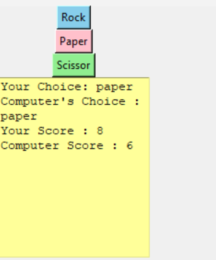

# Rock Paper Scissors Kleva

Welcome to **Rock Paper Scissors Kleva**, a fun and interactive GUI-based game built with Python and Tkinter! Test your luck and strategy against the computer in this classic game of Rock, Paper, Scissors. With a sleek interface and real-time score tracking, you'll be hooked in no time!

## Features

- **Interactive GUI**: Play using colorful buttons for Rock, Paper, and Scissors.
- **Score Tracking**: Keep tabs on your wins and the computer's with a live score display.
- **Randomized Opponent**: The computer randomly selects its move for a fair challenge.
- **Simple & Fun**: Easy-to-use interface perfect for all ages.

## How to Play

1. Launch the game by running the `Rock_Paper_Scissors.py` script.
2. A window will appear with three buttons: **Rock**, **Paper**, and **Scissors**.
3. Click one to make your choice.
4. The computer will randomly pick its move, and the result (win, lose, or tie) will be displayed.
5. Your scores are updated and shown in real-time below the buttons.
6. Keep playing to see who comes out on top!

## Installation

1. **Prerequisites**:
   - Python 3.x installed on your system.
   - Tkinter (usually included with Python; no additional installation needed).

2. **Steps**:
   - Clone or download the repository containing `Rock_Paper_Scissors.py`.
   - Navigate to the project directory in your terminal or command prompt.
   - Run the script:
     ```bash
     python Rock_Paper_Scissors.py
     ```
   - The game window will open, and you're ready to play!

## Game Logic

- **Rock** crushes **Scissors**.
- **Scissors** cuts **Paper**.
- **Paper** covers **Rock**.
- If both you and the computer choose the same option, it's a tie.
- The game uses a modular arithmetic approach to determine the winner efficiently.

## Screenshots



## Contributing

Want to make **Rock Paper Scissors Kleva** even cooler? Contributions are welcome! Here’s how you can help:
1. Fork the repository.
2. Create a new branch for your feature or bug fix.
3. Submit a pull request with a clear description of your changes.

Ideas for contributions:
- Add sound effects for button clicks or results.
- Implement a "best of" game mode.
- Enhance the UI with custom themes or animations.

## License

This project is licensed under the MIT License. Feel free to use, modify, and distribute it as you wish!

## Acknowledgments

- Built with love using Python and Tkinter.
- Inspired by the timeless game of Rock, Paper, Scissors.

Enjoy playing **Rock Paper Scissors Kleva**! 🎉